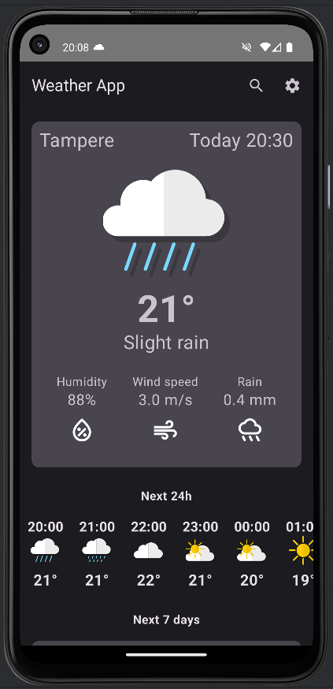
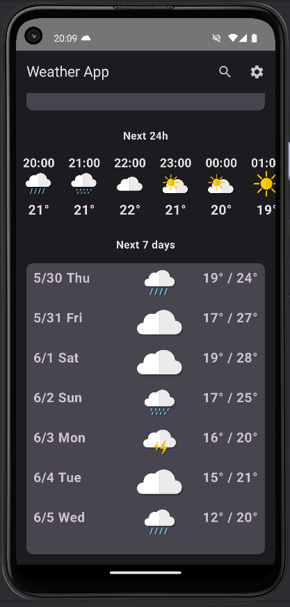
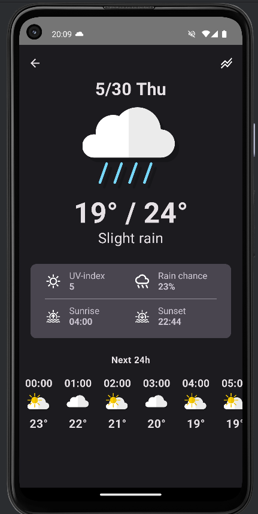
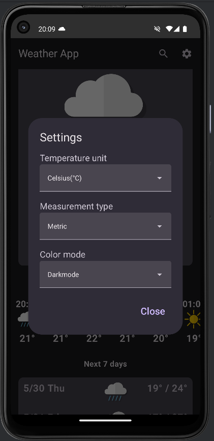
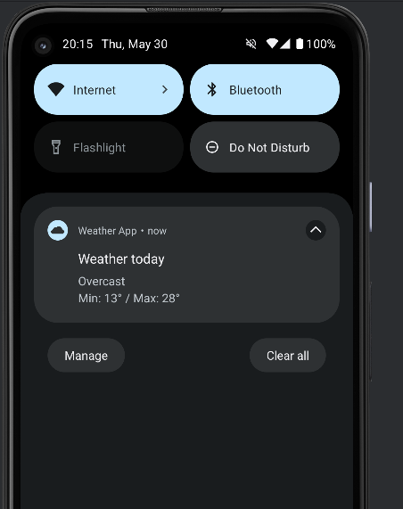

# Android Weather App

## About
This is a weather app for android devices.  
App was made as part of TAMK's Mobile development courses end project.

## Features
- Weather data display based on users location / city location
- Current weather, next 24 hours and next 7 days weather info
- Extra info provided for each day when clicking a day
- Data caching
- Visually pleasing UI
- Multiple setting choices
- Daily weather notifications

## Screencast
Link to the <a href=https://youtu.be/WRMiBSPdSBc>screencast</a>

## Technologies used

## Screenshots

### Main view

### Day view

### Settings

### Notification

